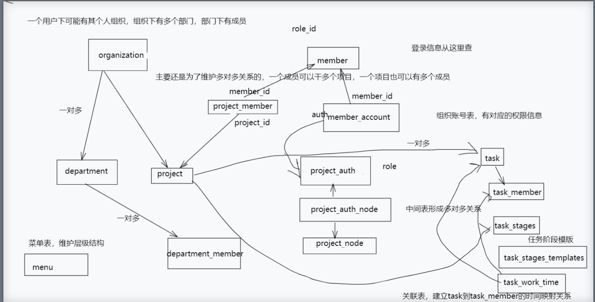

# 多项目管理协同系统

基于微服务架构的多项目管理程序

技术栈: gin，grpc，gorm，redis，mysql，etcd，k8s，prometheus+grafana监控mysql，openTelemetry+jaeger实现链路追踪。尝试将项目部署于k8s上，使其具有弹性扩展性，自我修复和自动更新等特点，具备高可用性和容错性。严格采用DDD，践行低耦合，高内聚，职责单一设计思想。
本地单机部署jmeter压测，经测试可抗千级别QPS.

1、使用 gin  框架完成 api  网关,通过网关负载均衡到后台grpc server。

2、grpc拦截器实现统一缓存，使用kafka解决缓存一致性的问题。

3、使用 JWT  无状态认证，增加了系统的可用性和伸缩性，大大减轻了服务端的压力

4、etcd  作为服务注册中心，使用lease对注册的服务设置 key TTL  值，定时保持服务的心跳监控服务健康状态。nacos  用作配置中心，避免硬编码，方便配置修改后期维护。

5、mysql  实现具体逻辑。实现RBAC鉴权设计模型等。

6、使用 redis  对验证码进行缓存。利用 redis  过期机制实现验证码定时过期。对用户的查询进行短时间缓存来加快数据查询，减轻数据库压力

大致表结构图，画的挺丑

